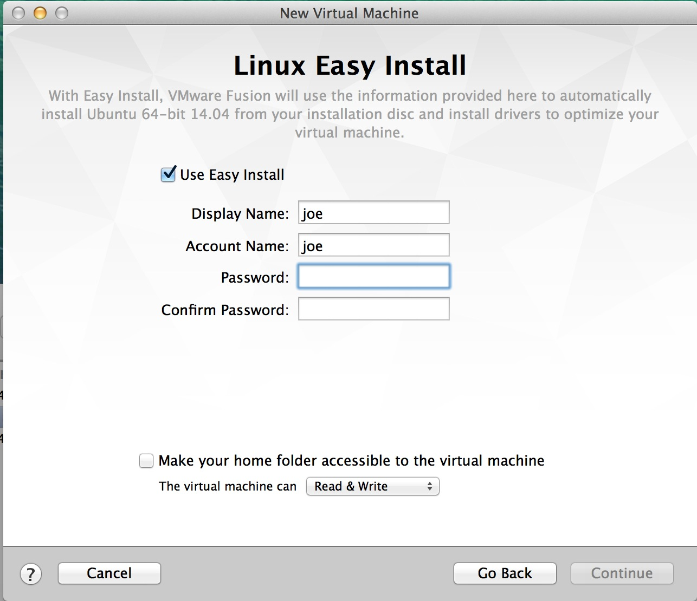
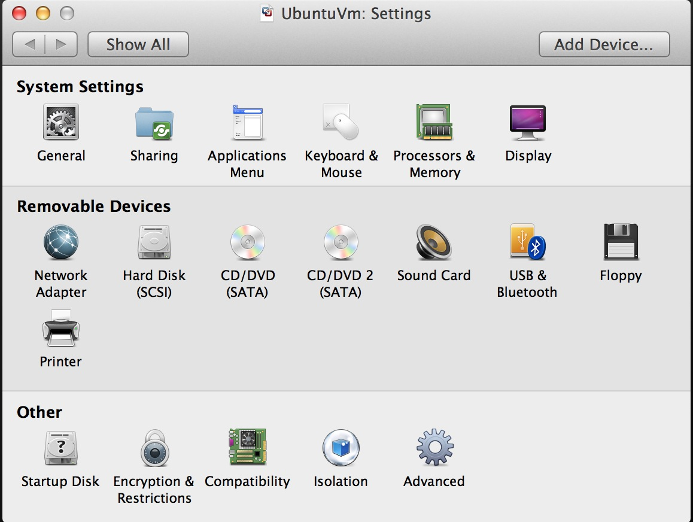
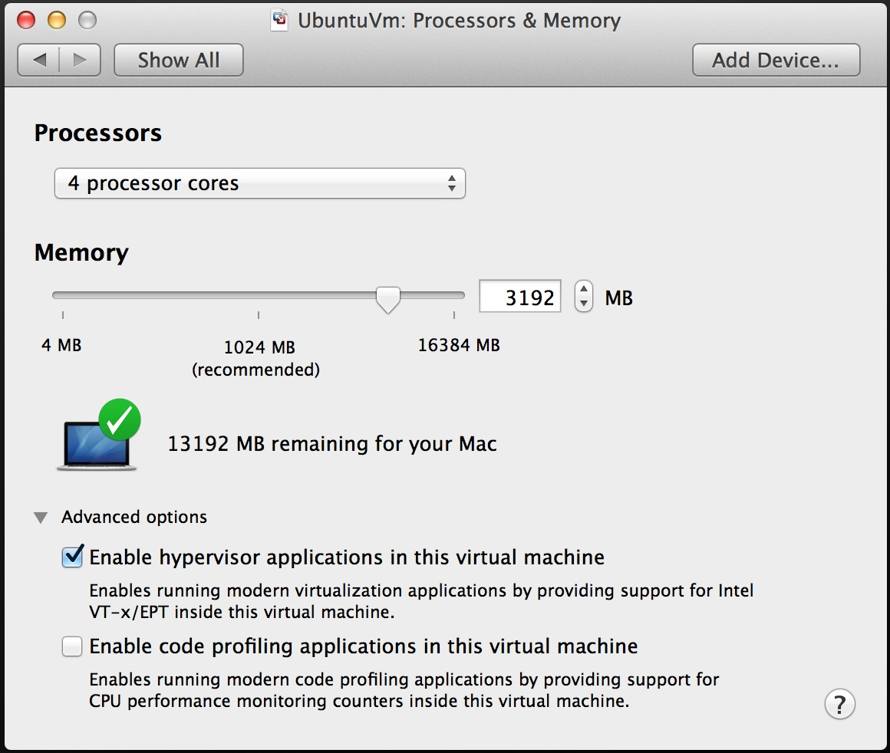
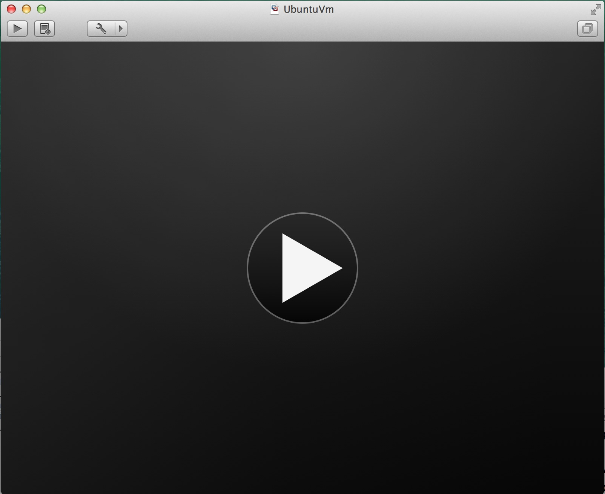
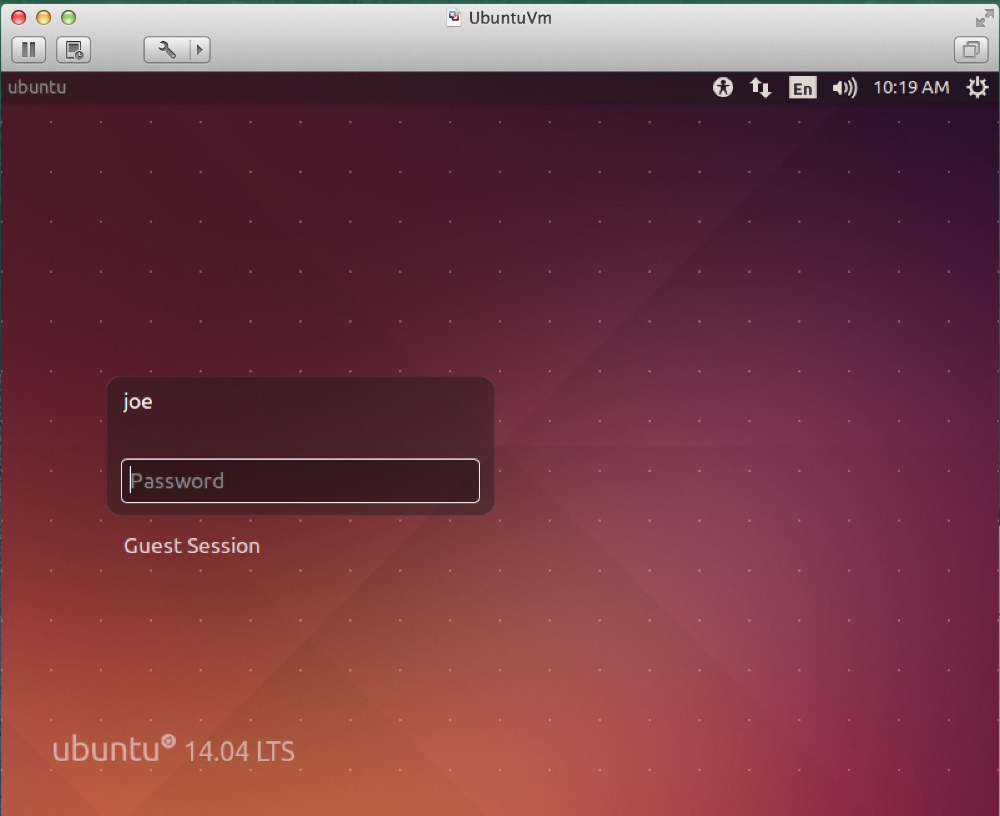
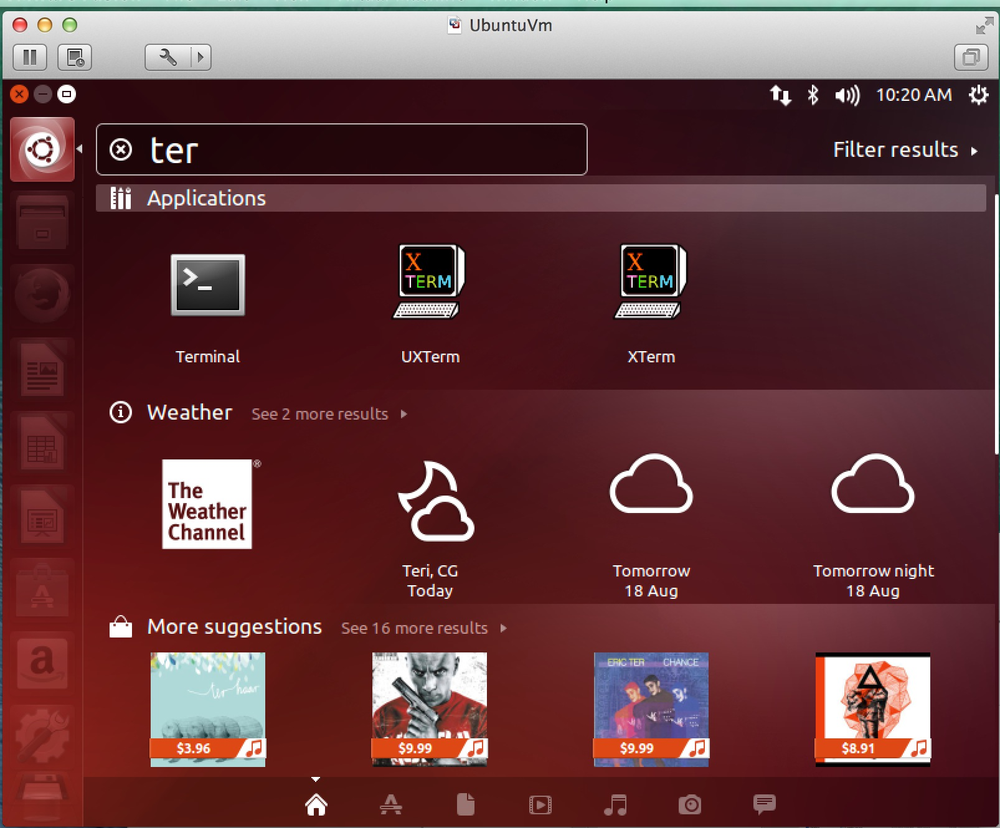
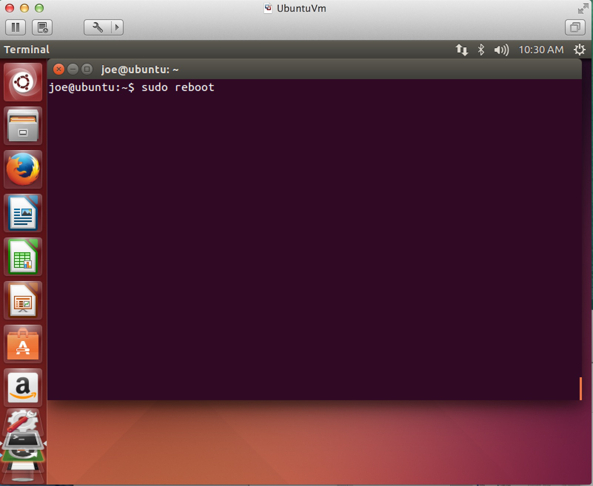

Installing a Linux Virtual Machine with VMware
==============================================

VMware Fusion vs Player vs Workstation
--------------------------------------

The instructions given here are with VMware Fusion on OSX. The steps are nearly identical for the other two VMware products.

Step 1: Create a VM
-------------------

.. figure:: linux_vm/1_create_vm.jpg
	:width: 650px

Step 2: Create the VM with an installer disk
--------------------------------------------

.. figure:: linux_vm/2_create_w_disk.jpg
	:width: 650px

Step 3: Locate the ISO file
---------------------------

.. figure:: linux_vm/3_pick_iso.jpg
	:width: 650px

Step 4: Fill out Easy-Install details
-------------------------------------

Step 5: Customize settings
--------------------------

.. figure:: linux_vm/5_customize.jpg
	:width: 650px

Step 6: Processors and memory
-----------------------------

Step 7: Start the VM
--------------------

Step 8: Wait for Easy-Install to complete
-----------------------------------------

.. figure:: linux_vm/9_easy_install.jpg
	:width: 650px

Step 9: Log into the new VM and Launch a terminal
-------------------------------------------------

Step 10: Install course software
--------------------------------

.. figure:: linux_vm/12_install_software.jpg
	:width: 650px

.. figure:: linux_vm/13_install_software.jpg
	:width: 650px

Step 11: Install security updates
---------------------------------

.. figure:: linux_vm/14_security_updates.jpg
	:width: 650px

.. figure:: linux_vm/15_security_updates.jpg
	:width: 650px

Step 12: Reboot
---------------

