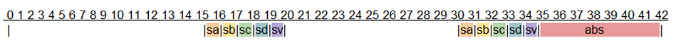

Process/Thread Scheduling
=========================

Kernel Mode vs. User Mode
-------------------------

- Kernel Mode
	- Can use the full instruction set of the CPU. Including:
		- Enabling / disabling interrupts
		- Setting special registers (page table pointer, interrupt table pointer, etc...)
	- Can modify any location in memory and modify page tables
- User Mode
	- Cannot use privileged instructions.
	- Can only modify the memory assigned to the process.

Interrupts
----------

- An interrupt is an event that requires immediate attention from the CPU.
- Algorithm for handling interrupts:
	#. Save all registers including the program counter to memory (typically the stack, but not always)
	#. CPU looks up the interrupt handler on the interrupt vector table and calls the interrupt handler
	#. Once the interrupt handler is completed, it restores all registers and returns to the program counter. It may optionally retry the instruction that caused the interrupt (in the case of a page fault).
	#. The program continues execution, not knowing anything has happened
- This algorithm is the same for both hardware and software interrupts.

Hardware Interrupts - PC Architecture
-------------------------------------

.. figure:: scheduling/pc_architecture.*
	:align: center
	:height: 500px
	:alt: PC Architecture

Hardware Interrupts - Sources
-----------------------------

- Southbridge (aka slow stuff) interrupts:
	- Early 8088/8086 PCs had a chip called the Intel 8253. 
	- SMP motherboards include a APIC or Advanced Programmable Interrupt Controller to help route interrupts in multi-processor scenarios
	- These chips control interrupts that come from disks, and
- Northbridge (aka fast stuff) Interrupts:
	- MMU - page faults (not present, not valid, insufficient permissions)
	- ALU - divide by zero exception
	- Clock - clock ticks

Software Interrupts
-------------------

- In operating systems that have separation between kernel and user space, software interrupts are used to implement system calls.
- Hello world in x86 assembly:

::

	section .text
		global _start
	_start:
		mov    edx, len      ; message length
		mov    ecx, msg      ; message to write
		mov    ebx, 1        ; 1 = stdout, the file descriptor
		mov    eax, 4        ; 4 = system call number (sys_write)
		int    0x80          ; software interrupt to call the kernel
	section .data
		msg    db   'Hello World!',0xa
		len    equ  $ - msg

- Software interrupts are much more expensive than making direct function calls through 'call' or 'jmp' like instructions.
- This cost is worth it in terms of the savings we get in terms of system reliability and security

Goals of a Process Scheduler
----------------------------

- The attributes of a process scheduling policy are a combination of the following:
	#. Fairness: make sure each process gets its fair share of the CPU.
	#. Efficiency: keep the CPU as busy as possible
	#. Response time: minimize the response time for interactive users.
	#. Turnaround: minimize the time batch users must wait for output
	#. Throughput: maximize the number of jobs processed per hour

- There are no scheduler implementations that are optimal in each of these attributes. There is always a trade-off. Many of these attributes can be contradictory.

Types of Scheduling Strategies
------------------------------

- Preemptive
- round-robin
- priority scheduling
	- shortest job first
	- critical path 
- Real-time 
	- Earliest deadline
	- Fixed priority
- Cooperative / event driven
- Run to completion / non-preemptive

OS Support
----------

- Non-Multitasking:
	- CP/M
	- MS-DOS
- Cooperative multi-tasking:
	- Windows 1.x-3.x
	- Mac OS 5 - 9
	- NetWare
- Preemptive multi-tasking
	- Minix
	- Windows 95-ME, NT4 - 7
	- Linux, BSDs
	- OS/2
	- Mac OSX
	- VMS
	- Unix

Types of Processes to Schedule
------------------------------
- Interactive processes
	- Spend most of their time in the 'not ready' state.
	- Wait on either I/O operations to complete or for user interaction
- CPU intensive processes
	- Spend most of their time in the 'ready' state.
	- Are largely CPU bound.

Preemptive Scheduling Key Terms
-------------------------------
- Quantum - the allotted time slice a program is run before a scheduling decision. Typically less than or equal to a clock tick.
- Clock - one of two triggers for the scheduling algorithm. On most CPUs, the clock ticks at a rate of 50-100Hz. Each clock tick issues a hardware interrupt which permits the operating system to run the scheduler
- Context Switch - the process by which through a software or hardware interrupt, a process switches from user mode to kernel mode or from kernel mode to user mode
- Process states:
	- running - currently executing on one or more CPUs
	- ready - ready to be executed, but not running
	- not ready - not ready to run, currently waiting on an event
	- terminated - process has exited and is being cleaned up

Choosing a Quantum
------------------
- Variables to consider:
	- Context switch / scheduler Overhead
	- Quantum Length
	- Number of Processes
- Total Overhead: If overhead is 5ms and the quantum is 20ms, then overhead is 20%. If the quantum is 50ms, then the overhead is only 10%
- Average Response Time: If overhead is 5ms, quantum, is 20ms, and 5 active processes exist, the time between runs will be: (overhead + quantum) * (runnable processes - 1) = 100ms. If the quantum is reduced to 10ms, then the time between runs will be: 60ms
- So, the choice of a smaller quantum will make the system more responsive, and a longer quantum will make the system more efficient

Context Switches
----------------

- A context switch is the process by which a program saves it state to switch to the operating system
- Context switches are caused by software and hardware interrupts

Context switch algorithm
------------------------

#. Save CPU registers of currently running process into the process table.
#. Change the process state to

   - Ready

       - if the context switch was caused by a hardware interrupt
       - if the context switch was caused by a software interrupt and the kernel
         can return immediately (non blocking call)

   - Not Ready

       - if the context switch was caused by a software interrupt and the
         kernel cannot return immediately (blocking call)

#. Invoke the scheduler to find a 'ready' process and change its state to 'running'
#. Restore registers for the new process and switch back to user mode.

Degrees of Preemption
---------------------

- Different operating systems have different degrees of preemption.
- In simpler operating systems, user-mode tasks can be preempted, but kernel-mode tasks cannot.
- Systems that also allow kernel-mode tasks to be preempted will be more responsive
- Systems with preemptive kernels:
	- Linux since 2.6 (2003)
	- Windows NT since NT4 (1996)
	- Solaris 2.0 (1991, I think)
	- AIX
	- Some BSD systems (NetBSD since v5, not sure about others)
- The two units that can be considered for scheduling are threads and processes
- Some operating systems only schedule on the process level and do not consider threads separately (Minix does this)
- Other operating systems schedule on a per-thread level (Linux, Windows, OSX)

Round - Robin Process Scheduling
--------------------------------

- Round robin scheduling is the simplest scheduling policy, but not the most efficient
- The operating system maintains two lists:
	- runnable list
	- non-runnable list
- The operating system simply runs through the runnable list in order executing each process one at a time. (or N at a time for N-CPUs)

Scheduling with Multiple Queues
-------------------------------

- Runnable threads are separated into queues based upon:
- Quantum length
- Process / thread priority
- Each queue is then run round-robin
- Algorithm (pseudo):

::

	thread schedule(thread interruptedThread) {
		let highest = 0, lowest = 9;
		Queue runQueue(10);
		interruptedThread.state = runnable or blocked
		queue(interruptedThread.priority).enqueue(interruptedThread)
		for(int i = highest; i <= lowest; i++) {
			if(queue(i) has any runnable threads) {
				thread t = queue.dequeue();
				t.state = running;
				return t;
			}
		}
	}

- What are some problems with this scheduling algorithm?
- What happens if higher priority threads are always runnable?
- How do we give processes that don't use their entire quantum (I/O bound) more priority?
- Improved Algorithm (pseudo): 

::

	thread schedule(thread interruptedThread) {
		let highest = 0, lowest = 9;
		Queue runQueue(10);
		if(interruptedThread.quantumUsed « Quantum) {
			interruptedThread.priority = max(interruptedThread.priority+1, highest);
		}
		interruptedThread.state = runnable or blocked
		queue(interruptedThread.priority).enqueue(interruptedThread)
		for(int i = highest; i «= lowest; i++) {
			if(queue(i) has any runnable threads) {
				thread t = queue.dequeue();
				t.state = running;
				t.priority -= 1;
				if(t.priority != t.basePriority && t.priority »= lowest) {
					t.priority = t.basePriority;
				}
				return t;
			}
		}
	}

- The reason that this scheduler is better is because it accomplishes two things:
	- It boosts priority of threads that don't completely use their allotted quantum (typically I/O bound)
	- If a thread is run, then its priority is temporarily decreased. The higher priority a thread is, the more chances it will have to run before it gets to the lowest queue. Also, this ensures that all ready processes will be run at some point.
- There are many variations on this type of scheduling that attempt to fine tune the rate of increase or decrease of thread priority. The most typical enhancement is to increase or decrease the amount of priority change with the number of priority changes.

Real-time Schedulers
--------------------

- This is most typically used in real-time operating systems where the most important aspect of a process is not its priority but its deadline to complete a unit of work.
- Attributes of real-time processes:
	- Arrival time (some absolute time)
	- Deadline (some time relative to the arrival time)
	- Execution requirement 
		- Time for computation
		- Time to complete system calls
- The goal of a real-time scheduler is to make sure as many processes as possible get their full execution requirement before the deadline. 
	- This isn't always possible (two processes arrive at the same time with 100ms requirements, both with deadlines 120ms away).
- In a real time scheduler, completion of all tasks before deadlines is the most important goal. The next important goal is achieving high CPU utilization.
- Terms:
	- Utilization - the sum of the execution time divided by the arrival rate of the process (entering the runnable state)
	- Schedulable - a set of processes is 'schedulable' if the utilization of the system is less than 100%
- Example:
	- Pa requires 2 units of time and arrives at t=0,5,10,15,....
	- Pb requires 1 unit of time and arrives at t=2,4,6,8,10,....
	- Utilization is: 2/5 + 1/2 = 90%. Therefore the system is schedulable.
	- If Pc is added and requires 3 units of time and arrives at t=0,5,10,15,.... then utilization is 2/5 + 3/5 + 1/2 = 150% and the system is not schedulable. (at least some processes will miss their deadlines)

.. figure:: scheduling/rts_1.png
	:align: center
	:width: 600px
	:alt: RTS Scheduler Example 1

Example Real World RTS Problem
------------------------------
- Example problem: Anti-Lock braking system.
- Problem description: 
	- Each wheel has a sensor that reports wheel speed every 15ms
	- An additional sensor reports vehicle speed every 15ms. Recording values takes 1ms.
	- Wheel angular velocity is (wheel speed) / (wheel radius)
	- Vehicle angular velocity is (vehicle speed) / (wheel radius)
	- Wheel slip is 1 - (wheel angular velocity) / (vehical angular velocity)
	- When slip = 1, a wheel is locked up. Ideal slip is 0.2. 
	- Engineers report that slip can change at a rate of 0.1 per 50ms
	- Adjusting anti-lock brakes for all tires takes 6ms.
- What are the scheduling requirements of this system? 
- What are the processes? 
- What are the arrival rates and deadlines of processes? 
- Do we need faster sensors?
- Can we save money by:
	- Getting a slower CPU?
	- Getting slower sensors?
	- Getting an ABS system that reacts slower?

Solution to Example Real World RTS Problem
------------------------------------------
- Sensor[A-D]: Period = 15ms, Requirement = 1ms
- Sensor[V]: Period = 15ms, Requirement = 1ms
- 2 samples can be taken and recorded for each tire in a period of 15ms*2+5ms = 35ms (the first recording period overlaps with the second reading so we don't count it)
- If a problem is found, we can schedule a process to adjust anti-lock brakes which will take 6ms. 35ms + 6ms = 41ms. This is faster than the rate of change in slip of 50ms.
- Is this schedulable? 1/15 + 1/15 + 1/15 + 1/15 + 1/15 + 6/35 = 50.47%. Yes!

- It appears that we also have 
- 8ms of extra time before our deadline 
- 25ms of idle CPU time every 42ms
- So, we can save money by using a slower CPU, ABS, and/or sensors.

Types of Real-Time Scheduler Implementations
--------------------------------------------

- Earliest deadline first
	- Works with estimates of process runtimes and arrival rates. 
	- When system utilization is over 100%, which processes miss deadlines is unpredictable
- Fixed priority
	- Gives the highest priority task CPU whenever it is in the ready state.
	- If utilization is over 100%, then lower priority tasks will not meet the deadline. This is more predictable and therefore more often favored
	- Simpler to implement

Additional Concerns in Advanced Scheduler Implementations
---------------------------------------------------------
- In more advanced operating systems, additional issues are considered in schedulers in addition to priority
	- CPU / Core affinity
	- How many pages of the working set of a process are resident
	- NUMA
- If a process is scheduled on a given core previously:
	- There is a decent chance that some of its pages are still in L1/L2/L3 cache. 
	- Scheduling on that CPU again is better than not. 
	- But, if too many processes are grouped on one CPU, they need to be migrated though.
- NUMA = Non Uniform Memory Access
	- This is common in machines with separate physical CPUs
	- Each CPU gets a memory bus to one bank of CPUs.
	- This means, that some of the memory is faster for for a given CPU and some memory is slower.
	- When choosing a CPU to execute on, where pages are allocated matters. 
	- Also, when the OS allocates pages, taking into account which NUMA region has been used before and how crowded / busy it is also matters.

Process Priority and Scheduling in Linux
----------------------------------------

- The Linux scheduler has several available policies:
	- Normal policies:
		- SCHED_OTHER - round-robin time sharing policy
		- SCHED_BATCH - batch policy
		- SCHED_IDLE - for running very low priority background jobs
	- Real-time policies:
		- SCHED_FIFO - first-in, first-out  policy
		- SCHED_RR - round-robin
- Scheduling policy is controlled by:
	- `int sched_setscheduler(pid_t pid, int policy, sched_param *param);`
	- the sched_param struct, takes amongst other things, a priority value
	- this priority value is only consumed by the real time schedulers
	- normal policies make use of 'nice' values

Linux Real Time Scheduler
-------------------------

- In Linux, real-time processes always have priority over non-real time processes.
- SCHED_FIFO:
	- Has one FIFO queue per-priority
	- When sched_setscheduler is called, the process goes into the front of the queue.
	- If the process is preempted, it keeps its place in the queue.
	- If sched_yield is called, then the process moves to the back of the queue.
	- Once running, the process will continue running until:
		- A higher priority process becomes runnable
		- The process issues an I/O request
		- The process calls sched_yield()
	- SCHED_FIFO processes are prevented from locking the system up by the RLIMIT_RTTIME limit. This is the CPU time limit that a process may take up before issuing a system call. After this soft limit is hit, the process is signaled several time until a hard limit is reached. If the hard limit is reached, the process is killed.
- SCHED_RR:
	- Exactly the same as SCHED_FIFO, except:
		- each process has a finite quantum.
		- if a process is preempted, it moves to the back of the queue

Linux Preemptive Scheduler
--------------------------
- SCHED_OTHER:
	- This is the default scheduling policy in Linux. 
	- Uses 'nice' values for prioritization.
- SCHED_BATCH:
	- Same as SCHED_OTHER, except...
	- Notifies scheduler that the process is both non-interactive and not I/O intensive
- SCHED_IDLE:
	- Same as SCHED_OTHER, except...
	- All processes in this class are always of lower priority than all other processes. This means that if any other process is runnable, these processes do not run.
	- 'nice' values are ignored completely

Nice Values
-----------

- Common in all UNIX schedulers is the use of 'nice' values.
- The nice value is the priority level of a process.
	- The highest priority is -20
	- The lowest priority is 19
	- The typical default priority is 0.
- When a process calls fork(), the new process inherits the parent's nice value.
- Non-root processes can increase the nice value
- Only root processes can decrease the nice value
- The effect of the nice value differs between scheduler implementations and is not the only factor taken into account in scheduling decisions

Process Scheduling in Windows
-----------------------------

- Windows has 6 process classes with 7 priorities within each class
- Classes:
	#. Idle
	#. Below Normal
	#. Normal
	#. Above Normal
	#. High
	#. Realtime
- Below - High:
	- Within a class, processes time-share relative to priority
	- Lower classes are not run unless higher classes are not runnable (or there are other idle CPUs)
- Idle - only runs if no other process is runnable
- Realtime - always run when runnable, will not be interrupted until the process makes a system call or goes to sleep.
- Process scheduler takes NUMA into account in:
	- XP Professional, Vista, 7
	- Server 2003 / 2008 / 2008R2
- Supports more advanced heap management and scheduling on systems with more than 64 CPUs in Server 2008R2 through the use of processor groups
- Multimedia Class Scheduler Service:
	- Creates classes of processes that have a minimum CPU requirement that the OS must meet.
	- Typically used to make sure audio, video, etc... are responsive in the presence of higher system loads.

User-Mode Schedulers
--------------------

- User-mode schedulers fall into two categories:
	- Per-process: N user threads per 1 process (N threads total)
	- Per-thread: N user threads per 1 kernel thread (N*K threads)
- Options:
	- Windows:
		- UMS Scheduler Component - 64-bit Server 2k8, Win 7
		- Fibers
	- Linux/Minix
		- GNU Pth
	- Custom:
		- Use of setjump, longjmp functions to save / switch stacks

User-Mode Threads: Why?
-----------------------

- Useful on systems with no support for kernel threads:
- Minix, Windows 3.x, Mac OS 5-9
- Useful on systems with huge or volatile thread counts:
	- An 8-CPU system with 24-32 active threads that doesn't create and destroy threads often, works very well.
	- An 8-CPU system with 2000 threads will grind to a halt.
	- An 8-CPU system with 10 threads, then 120 threads, then 5 threads, will waste a lot of time creating and destroying threads.
- Creating and destroying user mode threads is relatively cheap when compared to kernel threads.
- Systems like Erlang or others that create a high number of parallel components benefit greatly from being able to abstract an unlimited number of threads without the actual need for there to literally be that number of threads.

User-Mode Threads: Why Not?
---------------------------

- User mode threads have a lower degree of parallelism than do kernel mode threads. If you have 10 user threads on one kernel thread, you still are only executing on one CPU
- User mode threads don't benefit from operating system scheduler advantages:
	- Knowledge about CPU consumption
	- Knowledge about memory utilization
	- Knowledge about the page table and NUMA configuration
- If one user mode thread locks up, it locks up its entire kernel thread. Other user mode threads on that kernel thread cannot proceed.
- If one user mode thread makes a system call, the user mode threading library or the application must use asynchronous I/O function calls (which are more complex) to maintain responsiveness for other user mode threads. Otherwise the entire kernel thread will block.
- User mode threads do not perform as well as a similar number of kernel threads for number crunching applications (unless the number is » 4 per CPU)
- The reason for this is that kernel threads will have longer quantums than will user mode threads. User mode threads divide the quantum of one kernel mode thread.
- This problem is not as important for interactive, I/O based, or mixed applications.

GNU - Pth - User Mode Pthreads
------------------------------

- GNU Pth maps pretty closely to normal posix threading libraries.
- The use of GNU Pth is probably best illustrated with an example.
- The interesting calls are (pth_accept, pth_write, and pth_sleep). 
- Since this program is I/O bound, we need to use asynchronous I/O calls to make sure all threads are responsive. 
- This is accomplished with pth_* calls such as pth_write, pth_accept. 
- These calls are asynchronous wrappers to normal system calls.

::

	int main(int argc, char *argv[])
	{
		pth_attr_t attr;
		struct sockaddr_in sar;
		struct protoent *pe;
		struct sockaddr_in peer_addr;
		socklen_t peer_len;
		int sa, sw;
		int port;
		pth_init();
		port = atoi(argv[1]);
		signal(SIGPIPE, SIG_IGN);
		attr = pth_attr_new();
		pth_attr_set(attr, PTH_ATTR_NAME, "ticker");
		pth_attr_set(attr, PTH_ATTR_STACK_SIZE, 32*1024);
		pth_attr_set(attr, PTH_ATTR_JOINABLE, FALSE);
		pth_spawn(attr, ticker, NULL);
		pe = getprotobyname("tcp");
		sa = socket(AF_INET, SOCK_STREAM, pe-»p_proto);
		sar.sin_family = AF_INET;
		sar.sin_addr.s_addr = INADDR_ANY;
		sar.sin_port = htons(port);
		bind(sa, (struct sockaddr *)&sar, sizeof(struct sockaddr_in));
		listen(sa, 10);
		pth_attr_set(attr, PTH_ATTR_NAME, "handler");
		for (;;) {
			sw = pth_accept(sa, (struct sockaddr *)&peer_addr, &peer_len);
			pth_spawn(attr, handler, (void *)&sw);
		}
		return 0;
	}

	static void *handler(void *_arg)
	{
		int fd = *((int*)_arg);
		time_t now;
		char *ct;
		now = time(NULL);
		ct = ctime(&now);
		pth_write(fd, ct, strlen(ct));
		close(fd);
		return NULL;
	}

	static void *ticker(void *_arg)
	{
		time_t now;
		char *ct;
		float load;
		for (;;) {
			pth_sleep(5);
			now = time(NULL);
			ct = ctime(&now);
			ct[strlen(ct)-1] = '\0';
			pth_ctrl(PTH_CTRL_GETAVLOAD, &load);
			printf("ticker: time: %s, average load: %.2f\n", ct, load);
		}
		return NULL;
	}

PThreads - Kernel Threads
-------------------------
- Most POSIX compliant systems implement a pthreads library.
- In Minix, the PThreads library makes use of a layer on top of pth.
- In Linux, PThreads use the clone() system call to create lightweight processes (aka kernel threads).
- Example: 

::

	#include «pthread.h»

	int count;

	void increment( int ntimes ) {
		for(int i = 0; i « ntimes; i++) {
			count += 1;
		}
	}

	int main( int argc, char* argv[]) {
		const int n = 100000000;

		pthread_t thread1, thread2;
		pthread_attr_t threadAttribute;

		pthread_attr_init(&threadAttribute);
		pthread_attr_setscope(&threadAttribute, PTHREAD_SCOPE_SYSTEM);

		pthread_create(&thread1, &threadAttribute, (void * (*)(void *))increment, (void *) n);
		pthread_create(&thread2, &threadAttribute, (void * (*)(void *))increment, (void *) n);

		pthread_join(thread1, NULL);
		pthread_join(thread2, NULL);
		return 1;
	}

